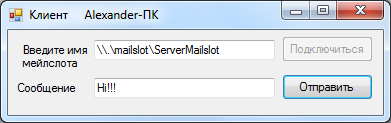
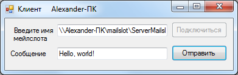

***Практическое задание № 2. Мэйлслоты (Mailslots)***

**Теория**

Каналы Mailslot (*почтовые ячейки*) позволяют выполнить одностороннюю
передачу данных от одного или нескольких клиентов одному или нескольким
серверам в локальной вычислительной сети. Их можно рассматривать, как
разновидность датаграммных каналов.

Как и у каналов, базовым объектом для реализации мэйлслотов является
объект «файл», поэтому для посылки и приема сообщений используются те же
самые функции Windows API, что и при работе с файлами (CreateFile,
ReadFile, WriteFile).

В отличие от каналов мэйлслоты позволяют передавать данные в
широковещательном режиме (один процесс может отправить сообщения сразу
всем узлам вычислительной сети).

Строка, представляющая имя мэйлслота, имеет следующий вид:

\\\\ИмяСервера\\mailslot\\ИмяМэйлслота

ИмяСервера -- имя компьютера в домене или IP-адрес компьютера. Если
процесс создает или открывает мэйлслот на локальном компьютере, вместо
имени сервера можно указать символ '.' (точка). Если требуется отправить
широковещательное сообщение, то вместо имени сервера следует указать
символ '\*' (звездочка).

Если при создании мэйлслота параметр, задающий максимальный размер
сообщения устанавливается равным нулю, то размер сообщения считается
неограниченным. При этом размер широковещательных сообщений,
передаваемых всем рабочим станциям и серверам домена не должен превышать
400 байт.

**Функции для работы с мэйлслотами**

1\. Для создания сервером мэйлслота используется следующая функция:

int **CreateMailslot**(string **lpName**, // строка, содержащая имя
мэйлслота

int **nMaxMessageSize**, // максимальный размер сообщения

int **lReadTimeout**, // время ожидания для чтения

int **securityAttributes**); // адрес структуры защиты

Возвращаемое значение -- идентификатор дескриптора (описателя)
мэйлслота.

2\. Проверка состояния мэйлслота сервером выполняется с помощью функции:

bool **GetMailslotInfo**(int **hMailslot**, // дескриптор мэйлслота

int **lpMaxMessageSize**, // максимальный размер сообщения

ref int **lpNextSize**, // размер следующего сообщения

ref int **lpMessageCount**, // количество сообщений в мэйлслоте

int **lpReadTimeout**); // время ожидания

Возвращаемое функцией значение -- результат ее выполнения
(успешно/неуспешно).

3\. Для создания мэйлслота клиентским процессом может быть использована
функция CreateFile. С ее помощью можно открыть мэйлслот, если вместо
имени файла указать имя мэйлслота. Функция возвращает дескриптор
мэйлслота и имеет следующий интерфейс:

int **CreateFile**(string **lpFileName**, // строка с именем мэйлслота

int **dwDesiredAccess**, // режим доступа

int **dwShareMode**, // режим совместного использования

int **lpSecurityAttributes**, // дескриптор защиты

int **dwCreationDisposition**, // параметры создания

int **dwFlagsAndAttributes**, // атрибуты файла

int **hTemplateFile**); // идентификатор файла с атрибутами

4\. Запись данных в мэйлслот выполняется с помощью функции WriteFile,
которая имеет следующий интерфейс:

bool **WriteFile**(int **hMailslot**, // дескриптор мэйлслота

byte\[\] **lpBuffer**, // адрес буфера, данные из которого будут
записаны в мэйлслот

uint **nNumberOfBytesToWrite**, // размер буфера

ref uint **lpNumberOfBytesWritten**, // число байт, действительно
записанных в мэйлслот

int **lpOverlapped**); // адрес структуры OVERLAPPED

Возвращаемое функцией значение -- результат ее выполнения.

5\. Чтение данных из мэйлслота выполняется с помощью функции со
следующим интерфейсом:

bool **ReadFile**(int **hMailslot**, // дескриптор мэйлслота

byte\[\] **lpBuffer**, // адрес буфера, в который будут прочитаны данные
из мэйлслота

uint **nNumberOfBytesToRead**, // размер буфера

ref uint **lpNumberOfBytesRead**, // количество действительно
прочитанных байт из мэйлслота

int **lpOverlapped**); // адрес структуры OVERLAPPED

Возвращаемое функцией значение -- результат ее выполнения.

6\. Функция, которая позволяет «принудительно» записать данные,
расположенные в буфере операционной системы, в файл, имеет следующий
вид:

bool **FlushFileBuffers**(int **hMailslot** // дескриптор мэйлслота);

Возвращаемое функцией значение -- результат ее выполнения.

7\. Закрытие дескриптора можно выполнить с помощью следующей функции:

bool **CloseHandle**(int **hMailslot** // дескриптор мэйлслота);

**Алгоритм обмена сообщениями с помощью мэйлслотов**

Обмен сообщениями с использованием мэйлслотов выполняется по следующему
алгоритму:

> 1\. Сервер создает мэйлслот с помощью функции CreateMailslot.
>
> 2\. Сервер проверяет наличие сообщений в мэйлслоте с помощью функции
> GetMailslotInfo.
>
> 3\. Клиент подключается к мэйлслоту с помощью функции CreateFile.
>
> 4\. Клиент записывает сообщения в мэйлслот сервера с помощью функции
> WriteFile.
>
> 5\. Сервер «принудительно» записывает данные, расположенные в буфере
> операционной системы, в файл мэйлслота с помощью функции
> FlushFileBuffers и считывает данные из мэйлслота с помощью функции
> ReadFile.
>
> 6\. Пока у клиента есть сообщения, выполняется последовательность
> шагов 4-5. Иначе выполняется переход к шагу 7.
>
> 7\. Клиент закрывает дескриптор мэйлслота сервера с помощью функции
> CloseHandle.
>
> 8\. Сервер закрывает дескриптор мэйлслота с помощью функции
> CloseHandle.

**Разработка приложения «Чат v 1.0»**

Разработаем приложение, которое позволяет с помощью мэйлслотов
отправлять серверу сообщения сразу от нескольких клиентов, необязательно
расположенных на одном узле сети. Сервер представляет собой форму, на
которой отображаются все полученные им сообщения (см. рис. 1).

***Рис. 1. Окно сервера при коммуникации с помощью мэйлслотов***

Клиент представляет собой форму, содержащую два поля ввода и две кнопки
(см. рис. 2).

***Рис. 2. Окно клиента при коммуникации с помощью мэйлслотов***

Первое поле предназначено для ввода имени мэйлслота в формате указанном
выше. При нажатии на кнопку «Подключиться» клиент производит подключение
к мэйлслоту сервера. Второе поле предназначено для ввода сообщения для
отправки. При нажатии на кнопку «Отправить» сообщение, в котором указано
имя компьютера клиента (для его идентификации) и текст сообщения,
введенный пользователем, будет отправлено серверу.

Код реализации сервера с комментариями приведен ниже:

+-----------------------------------------------------------------------+
| public partial class frmMain : Form                                   |
|                                                                       |
| {                                                                     |
|                                                                       |
| private int ClientHandleMailSlot; // дескриптор мэйлслота             |
|                                                                       |
| private string MailSlotName = \"\\\\\\\\\" + Dns.GetHostName() +      |
| \"\\\\mailslot\\\\ServerMailslot\"; // имя мэйлслота,                 |
| Dns.GetHostName() - метод, возвращающий имя машины, на которой        |
| запущено приложение                                                   |
|                                                                       |
| private Thread t; // поток для обслуживания мэйлслота                 |
|                                                                       |
| private bool \_continue = true; // флаг, указывающий продолжается ли  |
| работа с мэйлслотом                                                   |
|                                                                       |
| // конструктор формы                                                  |
|                                                                       |
| public frmMain()                                                      |
|                                                                       |
| {                                                                     |
|                                                                       |
| InitializeComponent();                                                |
|                                                                       |
| // создание мэйлслота                                                 |
|                                                                       |
| ClientHandleMailSlot =                                                |
| D                                                                     |
| IS.Import.CreateMailslot(\"\\\\\\\\.\\\\mailslot\\\\ServerMailslot\", |
| 0, DIS.Types.MAILSLOT_WAIT_FOREVER, 0);                               |
|                                                                       |
| // вывод имени мэйлслота в заголовок формы, чтобы можно было его      |
| использовать для ввода имени в форме клиента, запущенного на другом   |
| вычислительном узле                                                   |
|                                                                       |
| this.Text += \" \" + MailSlotName;                                    |
|                                                                       |
| // создание потока, отвечающего за работу с мэйлслотом                |
|                                                                       |
| Thread t = new Thread(ReceiveMessage);                                |
|                                                                       |
| t.Start();                                                            |
|                                                                       |
| }                                                                     |
|                                                                       |
| private void ReceiveMessage()                                         |
|                                                                       |
| {                                                                     |
|                                                                       |
| string msg = \"\"; // прочитанное сообщение                           |
|                                                                       |
| int MailslotSize = 0; // максимальный размер сообщения                |
|                                                                       |
| int lpNextSize = 0; // размер следующего сообщения                    |
|                                                                       |
| int MessageCount = 0; // количество сообщений в мэйлслоте             |
|                                                                       |
| uint realBytesReaded = 0; // количество реально прочитанных из        |
| мэйлслота байтов                                                      |
|                                                                       |
| // входим в бесконечный цикл работы с мэйлслотом                      |
|                                                                       |
| while (\_continue)                                                    |
|                                                                       |
| {                                                                     |
|                                                                       |
| // получаем информацию о состоянии мэйлслота                          |
|                                                                       |
| DIS.Import.GetMailslotInfo(ClientHandleMailSlot, MailslotSize, ref    |
| lpNextSize, ref MessageCount, 0);                                     |
|                                                                       |
| // если есть сообщения в мэйлслоте, то обрабатываем каждое из них     |
|                                                                       |
| if (MessageCount \> 0)                                                |
|                                                                       |
| for (int i = 0; i \< MessageCount; i++)                               |
|                                                                       |
| {                                                                     |
|                                                                       |
| byte\[\] buff = new byte\[1024\]; // буфер прочитанных из мэйлслота   |
| байтов                                                                |
|                                                                       |
| DIS.Import.FlushFileBuffers(ClientHandleMailSlot); //                 |
| \"принудительная\" запись данных, расположенные в буфере операционной |
| системы, в файл мэйлслота                                             |
|                                                                       |
| DIS.Import.ReadFile(ClientHandleMailSlot, buff, 1024, ref             |
| realBytesReaded, 0); // считываем последовательность байтов из        |
| мэйлслота в буфер buff                                                |
|                                                                       |
| msg = Encoding.Unicode.GetString(buff); // выполняем преобразование   |
| байтов в последовательность символов                                  |
|                                                                       |
| rtbMessages.Invoke((MethodInvoker)delegate                            |
|                                                                       |
| {                                                                     |
|                                                                       |
| if (msg != \"\")                                                      |
|                                                                       |
| rtbMessages.Text += \"\\n \>\> \" + msg + \" \\n\"; // выводим        |
| полученное сообщение на форму                                         |
|                                                                       |
| });                                                                   |
|                                                                       |
| Thread.Sleep(500); // приостанавливаем работу потока перед тем, как   |
| приступить к обслуживанию очередного клиента                          |
|                                                                       |
| }                                                                     |
|                                                                       |
| }                                                                     |
|                                                                       |
| }                                                                     |
|                                                                       |
| private void frmMain_FormClosing(object sender, FormClosingEventArgs  |
| e)                                                                    |
|                                                                       |
| {                                                                     |
|                                                                       |
| \_continue = false; // сообщаем, что работа с мэйлслотом завершена    |
|                                                                       |
| if (t != null)                                                        |
|                                                                       |
| t.Abort(); // завершаем поток                                         |
|                                                                       |
| if (ClientHandleMailSlot != -1)                                       |
|                                                                       |
| DIS.Import.CloseHandle(ClientHandleMailSlot); // закрываем дескриптор |
| мэйлслота                                                             |
|                                                                       |
| }                                                                     |
|                                                                       |
| }                                                                     |
+=======================================================================+
+-----------------------------------------------------------------------+

Код реализации клиента с комментариями приведен ниже:

+-----------------------------------------------------------------------+
| public partial class frmMain : Form                                   |
|                                                                       |
| {                                                                     |
|                                                                       |
| private Int32 HandleMailSlot; // дескриптор мэйлслота                 |
|                                                                       |
| // конструктор формы                                                  |
|                                                                       |
| public frmMain()                                                      |
|                                                                       |
| {                                                                     |
|                                                                       |
| InitializeComponent();                                                |
|                                                                       |
| this.Text += \" \" + Dns.GetHostName(); // выводим имя текущей машины |
| в заголовок формы                                                     |
|                                                                       |
| }                                                                     |
|                                                                       |
| // присоединение к мэйлслоту                                          |
|                                                                       |
| private void btnConnect_Click(object sender, EventArgs e)             |
|                                                                       |
| {                                                                     |
|                                                                       |
| try                                                                   |
|                                                                       |
| {                                                                     |
|                                                                       |
| // открываем мэйлслот, имя которого указано в поле tbMailSlot         |
|                                                                       |
| HandleMailSlot = DIS.Import.CreateFile(tbMailSlot.Text,               |
| DIS.Types.EFileAccess.GenericWrite, DIS.Types.EFileShare.Read, 0,     |
| DIS.Types.ECreationDisposition.OpenExisting, 0, 0);                   |
|                                                                       |
| if (HandleMailSlot != -1)                                             |
|                                                                       |
| {                                                                     |
|                                                                       |
| btnConnect.Enabled = false;                                           |
|                                                                       |
| btnSend.Enabled = true;                                               |
|                                                                       |
| }                                                                     |
|                                                                       |
| else                                                                  |
|                                                                       |
| MessageBox.Show(\"Не удалось подключиться к мейлслоту\");             |
|                                                                       |
| }                                                                     |
|                                                                       |
| catch                                                                 |
|                                                                       |
| {                                                                     |
|                                                                       |
| MessageBox.Show(\"Не удалось подключиться к мейлслоту\");             |
|                                                                       |
| }                                                                     |
|                                                                       |
| }                                                                     |
|                                                                       |
| // отправка сообщения                                                 |
|                                                                       |
| private void btnSend_Click(object sender, EventArgs e)                |
|                                                                       |
| {                                                                     |
|                                                                       |
| uint BytesWritten = 0; // количество реально записанных в мэйлслот    |
| байт                                                                  |
|                                                                       |
| byte\[\] buff =                                                       |
| Encoding.Unicode.GetBytes(Dns.GetHostName().ToString() + \" \>\> \" + |
| tbMessage.Text); // выполняем преобразование сообщения (вместе с      |
| идентификатором машины) в последовательность байт                     |
|                                                                       |
| DIS.Import.WriteFile(HandleMailSlot, buff,                            |
| Convert.ToUInt32(buff.Length), ref BytesWritten, 0); // выполняем     |
| запись последовательности байт в мэйлслот                             |
|                                                                       |
| }                                                                     |
|                                                                       |
| private void frmMain_FormClosing(object sender, FormClosingEventArgs  |
| e)                                                                    |
|                                                                       |
| {                                                                     |
|                                                                       |
| DIS.Import.CloseHandle(HandleMailSlot); // закрываем дескриптор       |
| мэйлслота                                                             |
|                                                                       |
| }                                                                     |
|                                                                       |
| }                                                                     |
+=======================================================================+
+-----------------------------------------------------------------------+

**Задание**

1\. Изучите разработанное приложение. Запустите исполняемый файл сервера
и клиента на одной машине, затем перенесите один из компонентов
распределенного приложения на другой вычислительный узел (лучше на
ноутбук, т.к. администратор ЛВС вуза может запретить обмен сообщения
между различными узлами ЛВС) и попробуйте его запустить. Запустите
несколько клиентов и попробуйте отправить сообщения одному серверу.

2\. Запустите несколько серверов на одной машине. Отправьте им сообщения
от нескольких клиентов. Объясните, почему приложение перестало работать.

3\. Модифицируйте приложение так, чтобы существовала возможность на
сервере идентифицировать клиентов не по имени вычислительного узла, а по
нику/логину пользователя.

4\. Модифицируйте приложение так, чтобы получился полноценный чат.
Клиент может отправлять сообщения всем клиентам, участвующим в беседе.
Для этого каждый клиент должен иметь возможность просмотра всех
сообщений от всех клиентов, а сервер должен содержать список клиентов,
которые хотят участвовать в беседе, чтобы каждый раз выполнять им
рассылку сообщений.

5\. Модифицируйте приложение так, чтобы клиенты, желающие принять
участие в беседе, находили сервер в сети с помощью широковещательного
запроса, а не через ввод имени машины, на которой расположен сервер, в
форме клиента.
